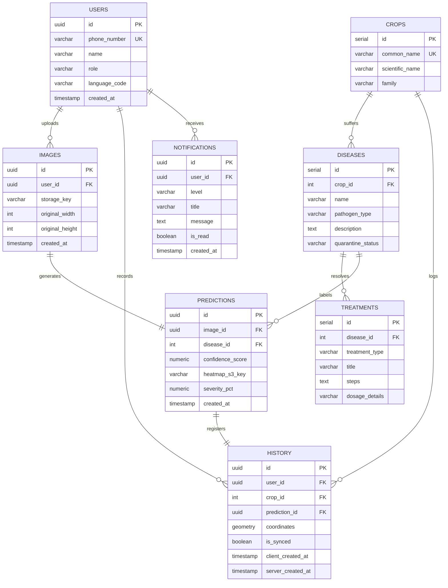

# Production Database Design & Optimization Spec
## Project: AgroVision AI — Crop Disease Detection Platform

---

## 1. Entity Relationship (ER) Diagram

The production database is built on **PostgreSQL 15+** with the **PostGIS** extension to support geo-spatial analytics. The design ensures high relational normalization (3NF) while integrating write-heavy log structures.



---

## 2. Production SQL Schema (DDL)

```sql
-- Enable necessary extensions
CREATE EXTENSION IF NOT EXISTS "uuid-ossp";
CREATE EXTENSION IF NOT EXISTS "postgis";

-- 1. USERS TABLE
CREATE TABLE users (
    id UUID PRIMARY KEY DEFAULT uuid_generate_v4(),
    phone_number VARCHAR(20) UNIQUE NOT NULL,
    name VARCHAR(100) NOT NULL,
    role VARCHAR(30) NOT NULL DEFAULT 'farmer' CHECK (role IN ('farmer', 'agronomist', 'admin')),
    language_code VARCHAR(10) NOT NULL DEFAULT 'en',
    created_at TIMESTAMP WITH TIME ZONE DEFAULT CURRENT_TIMESTAMP NOT NULL
);

-- 2. CROPS TABLE
CREATE TABLE crops (
    id SERIAL PRIMARY KEY,
    common_name VARCHAR(100) UNIQUE NOT NULL,
    scientific_name VARCHAR(150) NOT NULL,
    family VARCHAR(100) NOT NULL
);

-- 3. DISEASES TABLE
CREATE TABLE diseases (
    id SERIAL PRIMARY KEY,
    crop_id INT NOT NULL REFERENCES crops(id) ON DELETE CASCADE,
    name VARCHAR(150) NOT NULL,
    pathogen_type VARCHAR(50) NOT NULL CHECK (pathogen_type IN ('fungal', 'bacterial', 'viral', 'pest', 'deficiency', 'healthy')),
    description TEXT,
    quarantine_status VARCHAR(20) NOT NULL DEFAULT 'none' CHECK (quarantine_status IN ('none', 'alert', 'restrict')),
    CONSTRAINT uq_crop_disease UNIQUE (crop_id, name)
);

-- 4. TREATMENTS TABLE
CREATE TABLE treatments (
    id SERIAL PRIMARY KEY,
    disease_id INT NOT NULL REFERENCES diseases(id) ON DELETE CASCADE,
    treatment_type VARCHAR(30) NOT NULL CHECK (treatment_type IN ('organic', 'biological', 'chemical')),
    title VARCHAR(200) NOT NULL,
    steps TEXT NOT NULL,
    dosage_details VARCHAR(255),
    created_at TIMESTAMP WITH TIME ZONE DEFAULT CURRENT_TIMESTAMP NOT NULL
);

-- 5. IMAGES TABLE
CREATE TABLE images (
    id UUID PRIMARY KEY DEFAULT uuid_generate_v4(),
    user_id UUID REFERENCES users(id) ON DELETE SET NULL,
    storage_key VARCHAR(255) NOT NULL, -- S3 URL or bucket key
    original_width INT,
    original_height INT,
    created_at TIMESTAMP WITH TIME ZONE DEFAULT CURRENT_TIMESTAMP NOT NULL
);

-- 6. PREDICTIONS TABLE (Saves model execution outputs)
CREATE TABLE predictions (
    id UUID PRIMARY KEY DEFAULT uuid_generate_v4(),
    image_id UUID UNIQUE NOT NULL REFERENCES images(id) ON DELETE CASCADE,
    disease_id INT REFERENCES diseases(id) ON DELETE RESTRICT,
    confidence_score NUMERIC(5, 4) NOT NULL CHECK (confidence_score >= 0.0 AND confidence_score <= 1.0),
    heatmap_s3_key VARCHAR(255),
    severity_pct NUMERIC(5, 2) CHECK (severity_pct >= 0.0 AND severity_pct <= 100.0),
    created_at TIMESTAMP WITH TIME ZONE DEFAULT CURRENT_TIMESTAMP NOT NULL
);

-- 7. HISTORY TABLE (Core location-stamped logs - Partitioned by month)
CREATE TABLE history (
    id UUID DEFAULT uuid_generate_v4(),
    user_id UUID REFERENCES users(id) ON DELETE SET NULL,
    crop_id INT NOT NULL REFERENCES crops(id),
    prediction_id UUID REFERENCES predictions(id),
    coordinates GEOMETRY(Point, 4326),  -- Spatial data coordinates using WGS 84
    is_synced BOOLEAN DEFAULT TRUE NOT NULL,
    client_created_at TIMESTAMP WITH TIME ZONE NOT NULL,
    server_created_at TIMESTAMP WITH TIME ZONE DEFAULT CURRENT_TIMESTAMP NOT NULL,
    PRIMARY KEY (id, client_created_at)  -- Composite PK required for range partitioning
) PARTITION BY RANGE (client_created_at);

-- 8. NOTIFICATIONS TABLE
CREATE TABLE notifications (
    id UUID PRIMARY KEY DEFAULT uuid_generate_v4(),
    user_id UUID NOT NULL REFERENCES users(id) ON DELETE CASCADE,
    level VARCHAR(20) NOT NULL DEFAULT 'info' CHECK (level IN ('info', 'warning', 'critical')),
    title VARCHAR(150) NOT NULL,
    message TEXT NOT NULL,
    is_read BOOLEAN DEFAULT FALSE NOT NULL,
    created_at TIMESTAMP WITH TIME ZONE DEFAULT CURRENT_TIMESTAMP NOT NULL
);
```

---

## 3. Indexing & Relationships Strategy

To ensure queries finish within sub-millisecond ranges, we apply B-Tree and GIST indexes on target query anchors.

### 3.1 SQL Index Definitions
```sql
-- 1. Indexing foreign keys to prevent full table scans on joins
CREATE INDEX idx_diseases_crop ON diseases(crop_id);
CREATE INDEX idx_treatments_disease ON treatments(disease_id);
CREATE INDEX idx_images_user ON images(user_id);
CREATE INDEX idx_predictions_disease ON predictions(disease_id);

-- 2. Spatial Index on coordinates for geofencing queries
CREATE INDEX idx_history_location ON history USING GIST(coordinates);

-- 3. Composite Index on notification status (read optimization for list display)
CREATE INDEX idx_notifications_user_unread ON notifications(user_id) WHERE (is_read = FALSE);

-- 4. B-Tree index on high-frequency search labels
CREATE INDEX idx_history_user_client_date ON history(user_id, client_created_at DESC);
```

---

## 4. DB Optimizations Playbook

### 4.1 Horizontal Table Partitioning
The `history` table, expected to scale to millions of records, is partitioned monthly. Below is the creation template for partitions.

```sql
-- Partition for June 2026
CREATE TABLE history_y2026m06 PARTITION OF history
    FOR VALUES FROM ('2026-06-01 00:00:00+00') TO ('2026-07-01 00:00:00+00');

-- Partition for July 2026
CREATE TABLE history_y2026m07 PARTITION OF history
    FOR VALUES FROM ('2026-07-01 00:00:00+00') TO ('2026-08-01 00:00:00+00');
```
*Benefits:* Drops old history records easily (using `DROP TABLE` instead of heavy delete queries) and speeds up query plans using partition pruning.

### 4.2 Materialized Outbreak View
Rather than querying PostGIS dynamically during every admin page load, a Materialized View caches regional outbreak statistics daily.

```sql
CREATE MATERIALIZED VIEW mv_regional_outbreaks_daily AS
SELECT 
    h.crop_id,
    h.prediction_id,
    p.disease_id,
    d.name AS disease_name,
    COUNT(h.id) AS scan_count,
    ST_Centroid(ST_Collect(h.coordinates)) AS aggregate_center
FROM history h
JOIN predictions p ON h.prediction_id = p.id
JOIN diseases d ON p.disease_id = d.id
WHERE h.client_created_at >= NOW() - INTERVAL '14 days'
GROUP BY h.crop_id, h.prediction_id, p.disease_id, d.name
WITH DATA;

-- Unique index required to enable concurrent refresh
CREATE UNIQUE INDEX idx_mv_outbreaks_disease ON mv_regional_outbreaks_daily(disease_id);
```
*Refresh Execution command (Runs inside Celery Cron at 00:00 UTC):*
```sql
REFRESH MATERIALIZED VIEW CONCURRENTLY mv_regional_outbreaks_daily;
```

### 4.3 Spatial Query Tuning Example
Query to locate surrounding outbreaks of a specific pathogen within $15\text{ km}$:
```sql
SELECT 
    h.id,
    h.coordinates,
    ST_Distance(h.coordinates, ST_SetSRID(ST_MakePoint(77.5946, 12.9716), 4326)::geography) AS distance_meters
FROM history h
JOIN predictions p ON h.prediction_id = p.id
WHERE p.disease_id = 3 -- Late Blight ID
  AND ST_DWithin(h.coordinates, ST_SetSRID(ST_MakePoint(77.5946, 12.9716), 4326)::geography, 15000);
```

---

*This database schema and tuning playbook forms the foundation for data integrity and spatial capabilities on the AgroVision AI platform.*
