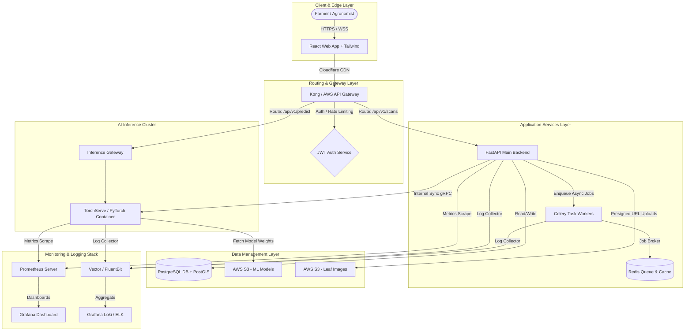
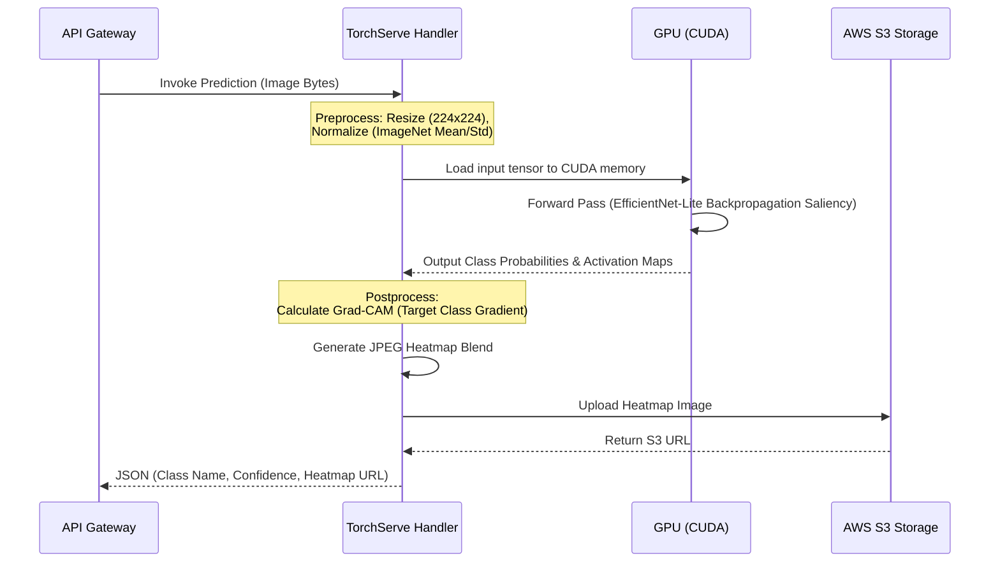
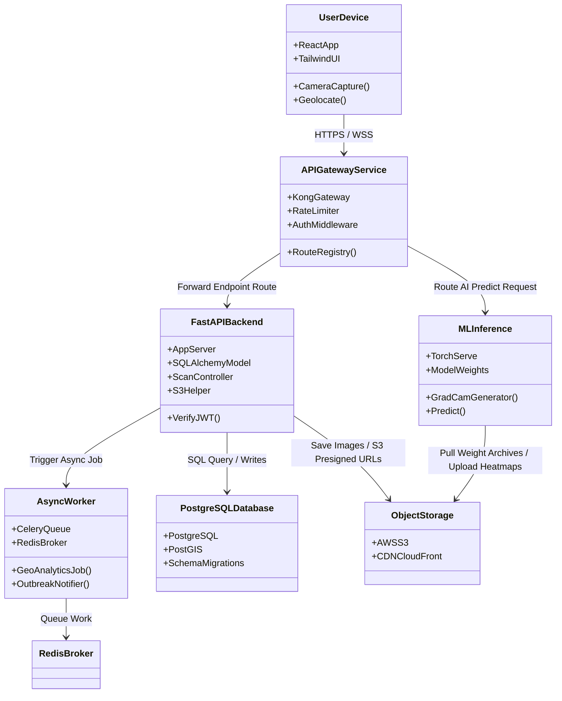
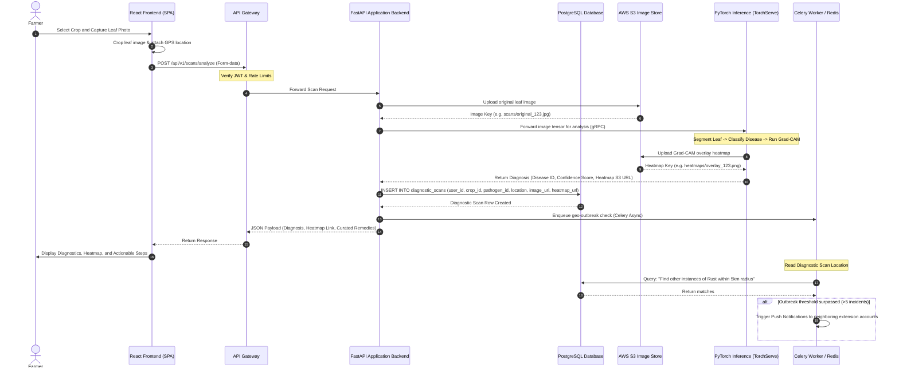

# Enterprise Architecture Design Document
## Project: AgroVision AI — Crop Disease Detection Platform

---

## 1. High-Level Design (HLD)

The AgroVision AI Enterprise Architecture is designed for high availability, low latency, robust data isolation, and scalable edge/cloud hybrid processing. It follows a microservices pattern wrapped in containerized modules.

### 1.1 High-Level Architecture Diagram
The layout below visualizes the flow of requests from the end-user up to the monitoring infrastructure.



### 1.2 System Topology Components
1.  **React + Tailwind Frontend:** Serves as the primary admin portal, agronomist workstation, and responsive farmer dashboard. It handles image upload sizing, local camera access, and interactive disease heatmap overlays.
2.  **API Gateway:** Acts as the single entry point. Responsibilities include SSL termination, rate limiting, request tracing, and JWT token decryption/validation.
3.  **FastAPI Backend:** Lightweight asynchronous core application service. Manages business logic, spatial database interactions, S3 pre-signed URL generation, and user configurations.
4.  **PyTorch (TorchServe) Inference Service:** GPU-accelerated model server. Separated from the backend application logic to allow independent auto-scaling of deep learning resources. Runs models quantized to FP16 or INT8 using LibTorch.
5.  **PostgreSQL + PostGIS Database:** Persistent storage for user records, diagnostic metadata, geospatial locations, and curated treatments.
6.  **AWS S3 (Cloud Image Storage):** Secure, immutable object storage for diagnostic crop images and versioned PyTorch `.mar` model archives.
7.  **Prometheus & Grafana + Loki:** Observability stack collecting request rates, memory footprints, GPU temperature/utilization, and distributed tracing.

---

## 2. Low-Level Design (LLD)

### 2.1 Microservice API Specification
The communication protocol between the client, API gateway, backend, and inference services relies on RESTful endpoints for CRUD operations and gRPC/REST for inference workloads.

#### 2.1.1 POST `/api/v1/scans/analyze`
Submits a diagnostic request with location metadata and an image file reference.

*   **Request Headers:**
    ```http
    Authorization: Bearer <JWT_TOKEN>
    Content-Type: multipart/form-data
    ```
*   **Request Multipart Body:**
    *   `crop_category_id`: `4` (Integer)
    *   `latitude`: `12.9716` (Float)
    *   `longitude`: `77.5946` (Float)
    *   `image`: `[Binary Image File]` (JPEG/PNG, max size 5MB)
*   **Response Payload (`200 OK`):**
    ```json
    {
      "scan_id": "c1fde02a-9db1-4e4b-a912-32a188f615ee",
      "timestamp": "2026-06-24T17:04:26Z",
      "crop": "Tomato",
      "diagnosis": {
        "pathogen": "Solanum Late Blight (Phytophthora infestans)",
        "confidence": 0.9423,
        "severity_pct": 24.5,
        "heatmap_overlay_url": "https://s3.agrovision.ai/heatmaps/c1fde02a.png"
      },
      "treatment": {
        "organic": {
          "title": "Copper fungicides & biological controls",
          "steps": [
            "Prune infected bottom leaves to increase aeration.",
            "Apply copper octanoate solution at first sign of disease recurrence."
          ]
        },
        "chemical": {
          "title": "Chlorothalonil or Mancozeb sprays",
          "steps": [
            "Spray Chlorothalonil 720 SFT at 1.5 lbs/acre.",
            "Observe safety pre-harvest intervals of 5 days."
          ]
        }
      }
    }
    ```

---

### 2.2 Database Schema Detail (ER Diagram Relationships)
The PostgreSQL schema uses standard relationships to normalize and cache queries efficiently.

```
 +------------------+          +-----------------------+          +-------------------------+
 |     users        |          |         crops         |          |        pathogens        |
 +------------------+          +-----------------------+          +-------------------------+
 | id (PK, UUID)    |          | id (PK, Serial)       |          | id (PK, Serial)         |
 | phone (Unique)   |          | common_name           |          | crop_id (FK -> crops)   |
 | name             |          | scientific_name       |          | name                    |
 | created_at       |          | family                |          | type (Enum)             |
 +--------+---------+          +-----------+-----------+          +------------+------------+
          |                                |                                   |
          |                                |                                   |
          |       +------------------------+-----------------------------------+
          |       |
          v       v
 +--------+-------+---------+          +-------------------------+
 |    diagnostic_scans      |          |       treatments        |
 +--------------------------+          +-------------------------+
 | id (PK, UUID)            |          | id (PK, Serial)         |
 | user_id (FK -> users)    |<---------| pathogen_id (FK)        |
 | crop_id (FK -> crops)    |          | treatment_type (Enum)   |
 | pathogen_id (FK)         |          | solution_title          |
 | confidence_score         |          | steps                   |
 | image_url                |          | dosage_instructions     |
 | location (Geometry, Point)          +-------------------------+
 | uploaded_at              |
 +--------------------------+
```

---

### 2.3 PyTorch (TorchServe) Inference Pipeline Sequence
The model server runs a multi-step sequence to clean the data, generate predictions, and overlay heatmaps.



#### 2.3.1 PyTorch Model Serving Code Pattern (Handler Script)
```python
# serve/handlers/crop_classifier_handler.py
import io
import torch
import torchvision.transforms as transforms
from PIL import Image
from ts.torch_handler.image_classifier import ImageClassifier

class CropClassifierHandler(ImageClassifier):
    def __init__(self):
        super(CropClassifierHandler, self).__init__()
        self.transform = transforms.Compose([
            transforms.Resize((224, 224)),
            transforms.ToTensor(),
            transforms.Normalize(
                mean=[0.485, 0.456, 0.406],
                std=[0.229, 0.224, 0.225]
            )
        ])

    def preprocess(self, data):
        images = []
        for row in data:
            image_data = row.get("data") or row.get("body")
            if isinstance(image_data, str):
                # Handle base64 encoded string
                import base64
                image_data = base64.b64decode(image_data)
            image = Image.open(io.BytesIO(image_data)).convert("RGB")
            image_tensor = self.transform(image)
            images.append(image_tensor)
        return torch.stack(images).to(self.device)

    def inference(self, model_input):
        with torch.no_grad():
            outputs = self.model(model_input)
            probabilities = torch.nn.functional.softmax(outputs, dim=1)
            return probabilities

    def postprocess(self, inference_output):
        # Maps model logits back to plant disease mappings
        results = []
        for probs in inference_output:
            top_prob, top_idx = torch.max(probs, dim=0)
            results.append({
                "class_id": int(top_idx),
                "confidence": float(top_prob)
            })
        return results
```

---

## 3. Component Diagram

The internal dependency structure displays boundary isolation. Application and Machine Learning resources share no dependencies other than communication interfaces.



---

## 4. Data Flow Sequence (Comprehensive Trace)

This sequence maps the path of a diagnostic scan request, tracing synchronous UI actions alongside asynchronous storage, database updates, and alerting jobs.



---

## 5. Directory Architecture Blueprint

### 5.1 React (Frontend) Structure
A modular, feature-oriented React layout containing Tailwind setups, hooks, and scalable state modules.

```
agrovision-frontend/
├── .env.example
├── package.json
├── postcss.config.js
├── tailwind.config.js
├── vite.config.js
├── public/
│   └── assets/
│       ├── logo.svg
│       └── markers/
├── src/
│   ├── main.jsx
│   ├── index.css                    # Tailwind imports & custom variables
│   ├── App.jsx                      # Root Routing
│   ├── assets/
│   │   └── images/
│   ├── components/                  # Common Reusable Core UI Components
│   │   ├── Button/
│   │   │   ├── Button.jsx
│   │   │   └── Button.test.jsx
│   │   ├── Card/
│   │   ├── Layout/
│   │   └── Modal/
│   ├── context/                     # Global State Contexts
│   │   ├── AuthContext.jsx
│   │   └── ThemeContext.jsx
│   ├── features/                    # Feature-Scoped Modules
│   │   ├── auth/
│   │   ├── dashboard/
│   │   │   ├── components/          # Dashboard-specific components (e.g. HeatmapViewer)
│   │   │   ├── hooks/
│   │   │   ├── services/
│   │   │   └── DashboardPage.jsx
│   │   └── diagnostics/
│   │       ├── components/          # CameraFrame, DiseaseReport
│   │       ├── DiagnosticPage.jsx
│   │       └── diagnosticSlice.js
│   ├── hooks/                       # Shared Custom Hooks
│   │   ├── useCamera.js
│   │   ├── useGeoLocation.js
│   │   └── useOfflineSync.js
│   ├── services/                    # Shared API Client Services
│   │   ├── api.js                   # Axios base client wrapper with JWT injection
│   │   └── scans.js
│   └── utils/                       # Shared Utility Functions
│       ├── formatters.js
│       └── validators.js
```

### 5.2 FastAPI (Backend) Structure
Clean architecture codebase partitioning routing endpoints, data models, schema validations, and services.

```
agrovision-backend/
├── .env.example
├── Dockerfile
├── requirements.txt
├── alembic.ini                      # DB Migrations Setup
├── alembic/                         # DB Migration scripts
│   └── versions/
└── app/
    ├── __init__.py
    ├── main.py                      # FastAPI App initialization & lifecycle event handlers
    ├── config.py                    # Pydantic BaseSettings Environment Loader
    ├── api/                         # Endpoint Routers
    │   ├── v1/
    │   │   ├── api.py               # Combined API routers
    │   │   ├── auth.py
    │   │   ├── crops.py
    │   │   └── scans.py
    │   └── dependencies/            # DB sessions, Auth injection
    │       ├── auth.py
    │       └── database.py
    ├── core/                        # System Core Configurations
    │   ├── security.py              # JWT generation, Password hashing
    │   └── cel_app.py               # Celery Configuration
    ├── models/                      # SQLAlchemy Declarative Models
    │   ├── base.py
    │   ├── crop.py
    │   ├── pathogen.py
    │   ├── scan.py
    │   └── user.py
    ├── schemas/                     # Pydantic Schemas for Input/Output Serialization
    │   ├── crop.py
    │   ├── scan.py
    │   └── user.py
    ├── services/                    # Core Business Logic Layer
    │   ├── s3.py                    # S3 file uploads & presigned keys
    │   └── inference_client.py      # Connects backend to TorchServe via gRPC
    └── tasks/                       # Celery Asynchronous Job Tasks
        ├── geo_tasks.py
        └── notification_tasks.py
```

### 5.3 AI Model & Inference Pipeline Structure
Model definition configurations, PyTorch training pipelines, model compilation, and TorchServe configurations.

```
agrovision-ml/
├── README.md
├── requirements.txt
├── config/
│   ├── hyperparameters.yaml
│   └── dataset_config.yaml
├── training/
│   ├── dataset.py                   # PyTorch Custom Dataset (Transformations, augmentations)
│   ├── model.py                     # EfficientNet-Lite & MobileViT architectures
│   ├── train.py                     # Training loop with TensorBoard logs
│   └── evaluate.py                  # F1-Score / Accuracy / ROC-AUC audits
├── inference/
│   ├── model_store/                 # Target folder for serialized .mar archives
│   ├── config.properties            # TorchServe configuration setting port and parameters
│   └── custom_handler.py            # Preprocessing, model execution, Grad-CAM heatmap generation
└── scripts/
    ├── compile_onnx.py              # Export PyTorch state-dict to ONNX
    ├── quantize_model.py            # Post-training quantization implementation script
    └── package_mar.sh               # Shell script to build the TorchServe Model Archive
```

---

## 6. Containerization & Deployment Configuration

To run the entire stack locally or deploy to cloud systems, we define structural container files.

### 6.1 React Frontend Dockerfile
A multi-stage build running Node to bundle static assets, and Nginx to serve assets with low latency.

```dockerfile
# Stage 1: Build the SPA
FROM node:20-alpine AS builder
WORKDIR /app
COPY package*.json ./
RUN npm ci
COPY . .
RUN npm run build

# Stage 2: Serve using Nginx
FROM nginx:1.25-alpine
COPY --from=builder /app/dist /usr/share/nginx/html
# Custom Nginx configuration to support SPA routing (fallback to index.html)
COPY nginx.conf /etc/nginx/conf.d/default.conf
EXPOSE 80
CMD ["nginx", "-g", "daemon off;"]
```

### 6.2 FastAPI Backend Dockerfile
Optimized slim container image for API routing.

```dockerfile
FROM python:3.11-slim-bookworm

ENV PYTHONUNBUFFERED=1 \
    PYTHONDONTWRITEBYTECODE=1 \
    PIP_NO_CACHE_DIR=1

WORKDIR /code

# Install system dependencies (build-essential for PostGIS C extensions, libpq-dev)
RUN apt-get update && apt-get install -y --no-install-recommends \
    build-essential \
    libpq-dev \
    gcc \
    && rm -rf /var/lib/apt/lists/*

COPY requirements.txt .
RUN pip install -r requirements.txt

COPY . .

EXPOSE 8000
CMD ["uvicorn", "app.main:app", "--host", "0.0.0.0", "--port", "8000"]
```

### 6.3 Orchestration Engine: `docker-compose.yml`
Sets up the integrated multi-container local stack including databases, network boundaries, and environment parameters.

```yaml
version: '3.8'

services:
  # 1. PostgreSQL Database + PostGIS Extensions
  db:
    image: postgis/postgis:15-3.3
    container_name: agrovision_db
    environment:
      POSTGRES_USER: agro_user
      POSTGRES_PASSWORD: agro_secure_pass
      POSTGRES_DB: agrovision_main
    ports:
      - "5432:5432"
    volumes:
      - postgres_data:/var/lib/postgresql/data
    networks:
      - agro_network
    healthcheck:
      test: ["CMD-SHELL", "pg_isready -U agro_user -d agrovision_main"]
      interval: 5s
      timeout: 5s
      retries: 5

  # 2. Redis Message Broker
  redis:
    image: redis:7-alpine
    container_name: agrovision_redis
    ports:
      - "6379:6379"
    networks:
      - agro_network

  # 3. FastAPI Core Backend Service
  backend:
    build:
      context: ./agrovision-backend
      dockerfile: Dockerfile
    container_name: agrovision_backend
    environment:
      - DATABASE_URL=postgresql://agro_user:agro_secure_pass@db:5432/agrovision_main
      - REDIS_URL=redis://redis:6379/0
      - INFERENCE_SERVICE_URL=http://torchserve:8080
      - JWT_SECRET=super_secret_jwt_signature_key
      - AWS_ACCESS_KEY_ID=test_key
      - AWS_SECRET_ACCESS_KEY=test_secret
      - S3_BUCKET_NAME=agrovision-scans
    ports:
      - "8000:8000"
    depends_on:
      db:
        condition: service_healthy
      redis:
        condition: service_started
    networks:
      - agro_network

  # 4. Celery Worker (Uses the same backend image codebase)
  celery_worker:
    build:
      context: ./agrovision-backend
      dockerfile: Dockerfile
    container_name: agrovision_celery
    command: celery -A app.core.cel_app worker --loglevel=info
    environment:
      - DATABASE_URL=postgresql://agro_user:agro_secure_pass@db:5432/agrovision_main
      - REDIS_URL=redis://redis:6379/0
    depends_on:
      - db
      - redis
    networks:
      - agro_network

  # 5. TorchServe PyTorch Model Server
  torchserve:
    image: pytorch/torchserve:latest-cpu # Switched to GPU image in production
    container_name: agrovision_torchserve
    user: root
    ports:
      - "8080:8080" # Inference API
      - "8081:8081" # Management API
      - "8082:8082" # Metrics API
    volumes:
      - ./agrovision-ml/inference/model_store:/home/model-server/model-store
    command: torchserve --start --ncs --model-store model-store --models crop_disease=crop_disease.mar
    networks:
      - agro_network

  # 6. React UI Frontend
  frontend:
    build:
      context: ./agrovision-frontend
      dockerfile: Dockerfile
    container_name: agrovision_frontend
    ports:
      - "80:80"
    depends_on:
      - backend
    networks:
      - agro_network

volumes:
  postgres_data:

networks:
  agro_network:
    driver: bridge
```

---

*This document serves as the high-fidelity enterprise architectural design reference for the AgroVision AI platform. Folder structures, database schemas, and networking components mapped here can be used as direct code setups.*
