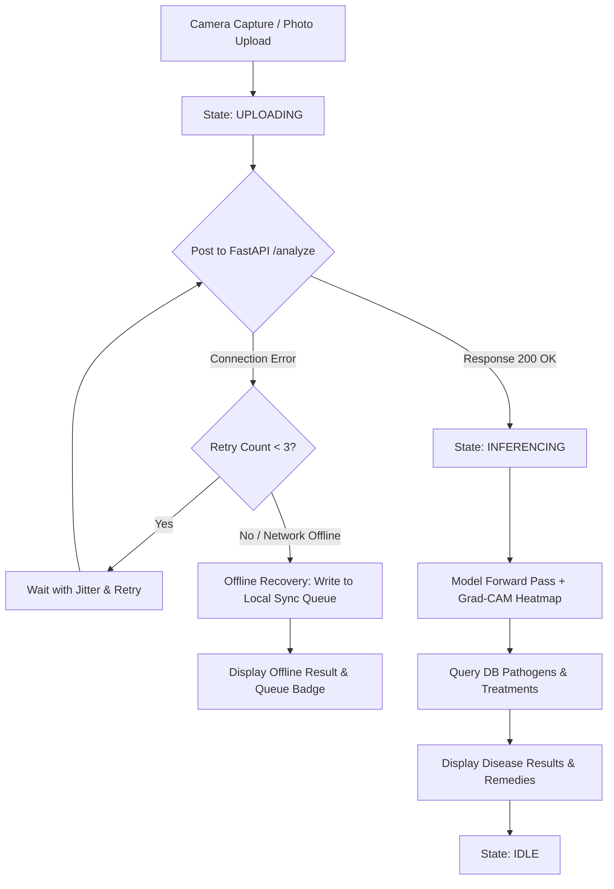

# End-to-End Integration Specification
## Project: AgroVision AI — Crop Disease Detection Platform

---

## 1. System Integration Flowchart

This map traces the lifecycle of a diagnostic request from camera capture to state machine transitions, with retry and offline error recovery pathways.



---

## 2. Frontend API Integration Client with Auto-Retry

This Axios API service incorporates custom exponential backoff retries with randomized jitter to handle network drops.

```javascript
// src/services/apiClient.js
import axios from 'axios';

const apiClient = axios.create({
  baseURL: 'http://localhost:8000/api/v1',
  timeout: 15000,
});

// Axios Request Interceptor to inject Auth Headers
apiClient.interceptors.request.use((config) => {
  const token = localStorage.getItem('token');
  if (token) {
    config.headers.Authorization = `Bearer ${token}`;
  }
  return config;
}, (error) => Promise.reject(error));

// Custom Exponential Backoff with Jitter Retry Logic
export async function fetchWithRetry(requestFn, retries = 3, delay = 1000) {
  try {
    return await requestFn();
  } catch (error) {
    const isNetworkError = !error.response;
    const is5xxServer = error.response && error.response.status >= 500;
    
    if ((isNetworkError || is5xxServer) && retries > 0) {
      // Calculate delay with randomized jitter: delay * 2^attempt + random(0, 1000)
      const jitter = Math.random() * 1000;
      const nextDelay = (delay * 2) + jitter;
      
      print(f"[*] Connection failed. Retrying in {nextDelay.toFixed(0)}ms... ({retries} attempts left)");
      await new Promise(resolve => setTimeout(resolve, nextDelay));
      return fetchWithRetry(requestFn, retries - 1, nextDelay);
    }
    throw error;
  }
}
```

---

## 3. React Integration Hook with State Machine & Recovery (`useScanUploader.js`)

Manages step-by-step loading state messages, error parameters, and writes scans locally if the server is unreachable.

```javascript
// src/hooks/useScanUploader.js
import { useState } from 'react';
import { apiClient, fetchWithRetry } from '../services/apiClient';

export const SCAN_STATES = {
  IDLE: 'IDLE',
  UPLOADING: 'UPLOADING',
  PREPROCESSING: 'PREPROCESSING',
  INFERENCING: 'INFERENCING',
  SUCCESS: 'SUCCESS',
  ERROR: 'ERROR'
};

export function useScanUploader() {
  const [scanState, setScanState] = useState(SCAN_STATES.IDLE);
  const [result, setResult] = useState(null);
  const [error, setError] = useState(null);

  const uploadAndAnalyzeScan = async (imageBlob, cropId, coords) => {
    setError(null);
    setScanState(SCAN_STATES.UPLOADING);

    const formData = new FormData();
    formData.append('image', imageBlob);
    formData.append('crop_category_id', cropId.toString());
    formData.append('latitude', coords.latitude?.toString() || '0');
    formData.append('longitude', coords.longitude?.toString() || '0');

    const apiCall = () => apiClient.post('/scans/analyze', formData, {
      onUploadProgress: (progressEvent) => {
        const percentCompleted = Math.round((progressEvent.loaded * 100) / progressEvent.total);
        if (percentCompleted === 100) {
          setScanState(SCAN_STATES.PREPROCESSING);
        }
      }
    });

    try {
      // Execute request with backoff retry
      const response = await fetchWithRetry(apiCall, 3, 1000);
      
      setScanState(SCAN_STATES.INFERENCING);
      // Wait briefly to smooth out UX transitions between API stages
      await new Promise(r => setTimeout(r, 600));
      
      setResult(response.data);
      setScanState(SCAN_STATES.SUCCESS);
      return response.data;
      
    } catch (err) {
      console.warn("[!] Upload failed. Initiating offline recovery...", err);
      
      // Error Recovery: Write scan payload locally
      const localQueue = JSON.parse(localStorage.getItem('sync_queue') || '[]');
      const offlineId = `offline_${Date.now()}`;
      
      // Save base64 image data locally for subsequent uploads
      const reader = new FileReader();
      reader.readAsDataURL(imageBlob);
      reader.onloadend = () => {
        const base64data = reader.result;
        localQueue.push({
          id: offlineId,
          cropId: cropId,
          coords: coords,
          imageBytes: base64data,
          timestamp: new Date().toISOString()
        });
        localStorage.setItem('sync_queue', JSON.stringify(localQueue));
      };

      setError("Offline mode active: Scan saved locally in queue.");
      setScanState(SCAN_STATES.ERROR);
    }
  };

  return { uploadAndAnalyzeScan, scanState, result, error };
}
```

---

## 4. API Backend to AI Engine Client Wrapper (`services/inference_client.py`)

FastAPI client service wrapping TorchServe predictions via gRPC or REST connection pools.

```python
# app/services/inference_client.py
import httpx
from fastapi import HTTPException

TORCHSERVE_URL = "http://localhost:8080/predictions/crop_disease"

async def get_model_inference(image_bytes: bytes) -> dict:
    async with httpx.AsyncClient(timeout=10.0) as client:
        try:
            # Post binary image payload directly to TorchServe endpoints
            response = await client.post(
                TORCHSERVE_URL,
                content=image_bytes,
                headers={"Content-Type": "application/octet-stream"}
            )
            
            if response.status_code != 200:
                raise HTTPException(
                    status_code=502,
                    detail=f"Inference engine failure code {response.status_code}: {response.text}"
                )
                
            prediction = response.json()
            return {
                "class_id": prediction.get("class_id"),
                "confidence": prediction.get("confidence"),
                "severity_pct": prediction.get("severity_pct", 0.0),
                "heatmap_s3_key": prediction.get("heatmap_s3_key")
            }
        except httpx.RequestError as exc:
            raise HTTPException(
                status_code=503,
                detail=f"Connection failed to TorchServe cluster: {exc}"
            )
```

---

*This integration framework connects UI states, Axios auto-retries, local storage buffers, and back-end model execution routines on the AgroVision AI platform.*
