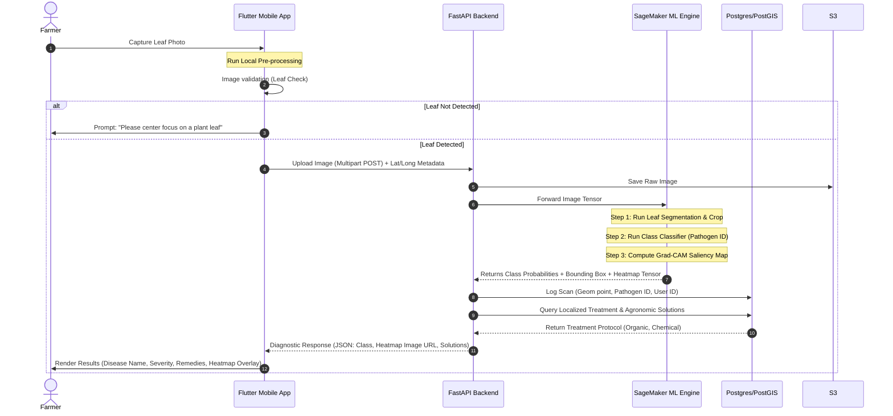
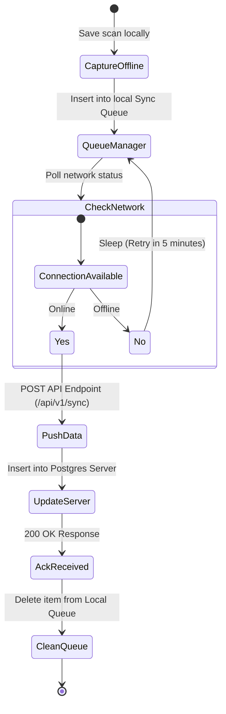

# Product Requirement Document (PRD) & Technical Research Document
## Project: AgroVision AI — Crop Disease Detection Platform

---

## 1. Executive Summary & Problem Analysis

### 1.1 Problem Statement
Agriculture is the backbone of global food security and local economies, yet crop yield losses due to pests and diseases range between **20% to 40% annually**, costing the global economy over **$220 billion**. 

Smallholder farmers in developing regions bear the brunt of this impact due to:
*   **Lack of Agronomic Expertise:** Real-time access to agricultural scientists is virtually non-existent, leading to diagnostic delays.
*   **Misdiagnosis and Pesticide Misuse:** Farmers frequently misidentify diseases and apply incorrect or excessive chemical inputs, which wastes financial resources, damages soil health, creates pesticide resistance, and pollutes local water tables.
*   **Delayed Action:** Many viral and fungal pathogens (e.g., Late Blight in potatoes, Leaf Rust in coffee) spread exponentially; by the time visual symptoms are obvious to untrained eyes, the crop is unsalvageable.
*   **Infrastructure Constraints:** Farmers operate in remote areas with unstable, low-bandwidth internet connections and possess low-to-mid tier mobile hardware, rendering standard cloud-dependent AI applications unusable.

### 1.2 Objective & Expected Outcomes
**AgroVision AI** is a production-ready, mobile-first agricultural intelligence ecosystem designed to put expert-level crop diagnostics directly into the hands of farmers worldwide. 

By leveraging cutting-edge deep learning, edge-optimized computer vision, and localized treatment engines, the platform delivers:
1.  **Immediate Diagnostic Clarification:** Instant classification of crop type and pathogen with a visual disease localization heatmap.
2.  **Edge Independence:** Full offline diagnostic capability via lightweight quantized models running on low-cost devices.
3.  **Biorational & Chemical Treatment Pipelines:** Curated, eco-friendly, and localized treatment recommendations to minimize environmental footprints and lower farming overheads.
4.  **Community & Agronomist Integration:** Seamless escalation of complex or unclassified anomalies to local extension officers and research institutions.

### 1.3 Success Metrics (KPIs)
To measure platform efficacy, AgroVision AI will track metrics across three distinct vectors:

| Category | Metric | Target KPI | Measurement Protocol |
| :--- | :--- | :--- | :--- |
| **Model Performance** | Classification F1-Score (In-the-wild) | **$\ge 93\%$** (Top-1 Accuracy) | Continuous evaluation against manually verified field-sample holdout sets. |
| | Inference Latency (Edge Client) | **$\le 250\text{ ms}$** | Automated logging of mobile hardware processing time (tested on Android API 21+). |
| | Localization Accuracy (IoU) | **$\ge 0.70$** (Intersection over Union) | Evaluating bounding boxes for diseased regions against expert annotated masks. |
| **Product & UX** | Offline Capability Ratio | **$100\%$** core offline classification | User is able to diagnose and access pre-loaded organic cures completely offline. |
| | User Diagnostic Success Rate | **$\ge 90\%$** | Percentage of uploads that yield a classification confidence score $> 80\%$. |
| | Treatment Adoption Rate | **$\ge 75\%$** | Post-diagnosis feedback loops validating if the farmer followed the recommendation. |
| **Macro Impact** | Yield Protection Index | **$\ge 15\%$** increase in yield | Comparative seasonal crop yields of active users vs. control groups in targeted regions. |
| | Pesticide Expenditure Reduction | **$\ge 25\%$** cost reduction | Self-reported chemical purchase audits tracking fertilizer/pesticide spend. |

---

## 2. Scientific Research Papers & State-of-the-Art Review

To architect the deep learning core of AgroVision AI, we analyze state-of-the-art computer vision methodologies in plant phenotyping and pathology classification.

### 2.1 Deep Convolutional Networks (CNNs) vs. Mobile-First Architectures
Traditionally, networks like **ResNet-50** and **DenseNet-121** achieved high accuracy on static image datasets. However, their parameter size ($25\text{M} - 60\text{M}$ parameters) and high FLOP counts make them unsuitable for mobile edge deployments.
*   **MobileNetV3 (Large/Small):** Utilizes hardware-aware AutoML to design efficient networks incorporating depthwise separable convolutions, squeeze-and-excitation blocks, and the Hard-Swish activation function. It achieves a 75.2% ImageNet Top-1 accuracy while requiring only $\approx 5.4\text{M}$ parameters. 
*   **EfficientNet-Lite (0-4):** Google's mobile-optimized family which strips away specialized activation functions (replacing Swish with ReLU6) and removes squeeze-and-excitation layers. This makes them highly compatible with standard INT8 quantization pipelines on mobile Neural Processing Units (NPUs) and Digital Signal Processors (DSPs), with almost zero accuracy loss.

### 2.2 Vision Transformers (ViTs) and Attention Mechanisms
Vision Transformers (e.g., **DeiT**, **MobileViT**) represent a paradigm shift in computer vision.
*   *Pros:* Self-attention layers capture global context, meaning the model excels at distinguishing plant structures (e.g., stem vs. leaf vs. soil) and identifying multi-localized diseases.
*   *Cons:* ViTs are highly data-hungry, computationally intensive, and lack the inductive bias of CNNs. MobileViT addresses this by combining the strengths of CNNs (local processing) and ViTs (global modeling) to create a model with only $2\text{M}$ parameters, which achieves competitive accuracy on mobile hardware.

### 2.3 Object Detection & Localization (YOLO vs. Segmentation)
Simple image classification suffers from "contextual noise" (e.g., weeds, soil, hands holding the leaf). 
*   Implementing **YOLOv8-Nano** or **YOLOv9-Tiny** as a pre-processing localization step ensures that the model first detects leaves and crops them from the background before passing the cropped leaf image to the classification backbone. 
*   Alternatively, using **Grad-CAM (Gradient-weighted Class Activation Mapping)** allows us to output attention heatmaps without training an explicit object detector, highlighting the exact visual regions that triggered the model's classification.

### 2.4 Mobile Deployment & Quantization
Deep learning models typically run using FP32 (32-bit floating point) weights. 
*   **Post-Training Quantization (PTQ):** Compresses weights to 8-bit integers (INT8). This reduces model size by **75%** (e.g., from $40\text{MB}$ to $10\text{MB}$) and enables hardware acceleration on edge devices.
*   **Quantization-Aware Training (QAT):** Emulates INT8 precision during the training forward pass, allowing the network to adapt its weights to the lower precision format. This mitigates accuracy degradation, keeping loss below $1\%$ compared to FP32 baselines.

---

## 3. Dataset Analysis & Comparison

Training a robust classifier requires deep understanding of available agronomic datasets.

### 3.1 Dataset Evaluation

| Dataset Name | Size (Images) | Number of Classes | Environmental Conditions | Limitations & Gaps | Suitability for AgroVision AI |
| :--- | :--- | :--- | :--- | :--- | :--- |
| **PlantVillage** | ~54,306 | 38 (14 crop species) | Controlled laboratory setting (homogenous gray backgrounds, uniform studio lighting). | Does not reflect real-world farm conditions. High risk of overfitting to lab backgrounds; poor validation accuracy in actual fields (domain shift). | Primary baseline for pre-training. Not suitable alone for production models. |
| **Digipathos** | ~9,000 | Multiple crops/diseases | Semi-controlled and field-captured. Includes varied lighting and scale. | Small class size per crop type. Heavily focused on Brazilian native crops. | Useful for validation and testing resilience against background noise and shadows. |
| **IP102** | 75,222 | 102 (Pests & insects) | Natural field environments. Highly diverse views. | High label noise; unbalanced class distributions. | Integration target for a secondary Pest Detection Model. |
| **Rice Leaf Disease Dataset** | ~1,500 | 4 (Rice specific) | Natural field capture under natural sun. | Highly limited classes and volume. | fine-tuning domain-specific models for Southeast Asian deployments. |
| **AgroVision Field Dataset** (Proposed Custom) | 100,000+ | 120 (Target crops + multi-diseases) | Real-world in-the-wild field conditions (dust, wet leaves, shadows, camera glare). | Requires manual expert annotation (extension officers, plant pathologists). | **Core training target.** Curated by combining public data with domain-specific field operations. |

### 3.2 Mitigation of Domain Shift & Real-World Noise
Models trained on clean datasets fail catastrophically in the field. To ensure production robustness:
1.  **Synthetic Background Injection:** During training, we programmatically segment leaves from clean datasets (e.g., using SAM - Segment Anything Model) and superimpose them onto random agricultural backgrounds (soil, weeds, farming equipment).
2.  **Advanced Data Augmentation:** Employing a customized pipeline via the [Albumentations](https://github.com/albumentations-team/albumentations) library:
    *   *Spatial:* Random scaling, cropping, rotations, and perspective warps (simulating hand tremors).
    *   *Spectral:* Random brightness, contrast changes, shadows (simulating direct sunlight vs. cloudy weather), and camera sensor noise.
3.  **Self-Supervised Pre-training (Contrastive Learning):** Pre-training the backbone using SimCLR or DINO on millions of unlabelled agricultural images. This teaches the model to extract generic plant representations (veins, leaf edges, texture) before fine-tuning on labeled disease datasets.

---

## 4. Target User Persona & Field Requirements

Developing for rural agriculture requires empathetic user-centric design that respects environmental constraints.

### 4.1 Persona Profiles

```
+---------------------------------------------------------------------------------+
|                                 USER PERSONAS                                   |
+------------------------------------+--------------------------------------------+
| 1. Smallholder Farmer (Suresh)    | 2. Extension Officer (Dr. Elena)           |
+------------------------------------+--------------------------------------------+
| * Tech Literacy: Low               | * Tech Literacy: Medium-High               |
| * Connectivity: 2G/3G (Intermittent)| * Connectivity: Standard 4G / Offline Sync  |
| * Hardware: Low-end Android (4GB)  | * Hardware: Mid-range Smartphone / Tablet  |
| * Needs: Plain vernacular text,     | * Needs: Aggregated regional heatmaps,     |
|   voice-read out of recommendations,|   PDF report sharing, exportable data      |
|   offline diagnosis, organic cures.|   for localized research.                  |
+------------------------------------+--------------------------------------------+
```

#### Persona 1: Suresh — Smallholder Tomato Farmer
*   **Context:** Owns a 2-acre farm in Karnataka, India.
*   **Tech Profile:** Uses an entry-level Android phone with a cracked screen. Unstable 2G/3G connectivity.
*   **Pain Points:** Cannot afford expensive chemical treatments. Relies on local pesticide sellers who often recommend incorrect chemicals to drive sales.
*   **Product Fit:** Needs a simple, high-contrast UI with local language translation (Kannada), audio guides, and lightweight offline diagnostics.

#### Persona 2: Dr. Elena — Agronomist & Extension Officer
*   **Context:** Manages agricultural support services for a regional municipality in Colombia.
*   **Tech Profile:** Uses a modern mid-range smartphone and tablet.
*   **Pain Points:** Manages over 400 farms. Cannot visit every farm weekly; struggles to track disease outbreaks geographically.
*   **Product Fit:** Needs a web dashboard, PDF export capabilities, diagnostic verification logs, and geo-tagged analytics to allocate pesticide/subsidy resources.

### 4.2 Key Field Constraints & Design Guidelines
1.  **Offline-First Strategy:** The app must load, run inference, render recommendations, and store diagnostics locally. Cloud sync is deferred until a stable connection is detected.
2.  **One-Handed/Glove-Friendly UI:** Large touch targets, simplified flows.
3.  **In-App Camera Guidance Overlay:** Real-time feedback guides the user to center the leaf, keep the camera parallel to avoid perspective skew, and notify if there is insufficient lighting.
4.  **Local Language & Voice Synthesis:** Text-to-speech engine to read diagnostic assessments and application directions in regional dialects.

---

## 5. Functional Requirements

### 5.1 System Scope Matrix

| Req ID | Feature Group | Description | Priority | Edge/Cloud Target |
| :--- | :--- | :--- | :--- | :--- |
| **FR-1.1** | Camera Capture | Custom camera overlay enforcing optimal focal distance and centering. | P0 | Edge |
| **FR-1.2** | Image Validation | Pre-inference check verifying if a leaf is present. Prevents scanning of faces, dirt, or non-plant objects. | P0 | Edge (Mobile classifier) |
| **FR-2.1** | Disease Classifier | Multi-class identification outputting crop type, health status, pathogen (if any), and confidence score. | P0 | Both (Edge/Cloud) |
| **FR-2.2** | Visual Explanation | Bounding box or heatmap overlay (Grad-CAM) outlining the exact visual symptoms. | P1 | Both (Edge/Cloud) |
| **FR-3.1** | Actionable Remedies | Non-technical treatment recommendations split into organic/preventative, biological controls, and localized chemical solutions. | P0 | Edge (Local DB) |
| **FR-3.2** | Dosage Calculator | Interactive input based on farm size to calculate exact quantity of treatment needed (avoiding runoff). | P1 | Edge (Local calculation) |
| **FR-4.1** | Offline Mode | Local fallback model execution when network status is offline. | P0 | Edge |
| **FR-4.2** | Queue Manager | Queueing offline diagnostic results with GPS tags and syncing to cloud database once online. | P0 | Edge |
| **FR-5.1** | Extension Portal | One-click button to escalate ambiguous scans (confidence $< 60\%$) to an active Agronomist. | P1 | Cloud (Websocket + Push) |
| **FR-6.1** | Regional Analytics | Interactive geo-dashboard mapping aggregated disease reports to track outbreaks. | P2 | Cloud (Admin Portal) |

---

## 6. Non-Functional Requirements

### 6.1 Performance & Latency
*   **Local Inference Latency:** $\le 250\text{ ms}$ on a standard ARM Cortex-A53 processor.
*   **Network Sync Latency:** Synchronizing local records to cloud should happen in under $5\text{ seconds}$ once a connection of $\ge 50\text{ Kbps}$ is established.
*   **Startup Time:** App must start and display camera capture view within $1.5\text{ seconds}$ from cold boot.

### 6.2 Accuracy & Safety Limits
*   **Safety Interventions (False Positive Guard):** For dangerous pathogens (e.g., quarantine pests like Ralstonia solanacearum), a classification trigger forces manual agronomist validation before recommending toxic actions.
*   **Minimum Confidence Threshold:** If the model's top classification confidence is $< 70\%$, the UI displays a warning: *"Uncertain Diagnosis: Please retake the photo in better light or send to an Agronomist."*

### 6.3 Security, Privacy & Data Integrity
*   **GDPR / Local Data Protection Compliance:** Farmer personal details are encrypted.
*   **Geospatial Obfuscation:** Public disease mapping dashboards must obfuscate farmer coordinates by a radius of $1\text{ km}$ to prevent specific targeting of farms or land-devaluation risks.
*   **Data Serialization:** Offline records stored locally must be encrypted using AES-256 (via Hive/Isar on mobile) to prevent tampering.

---

## 7. Competitive & Existing Solutions Landscape

Currently, several crop diagnosis apps exist, but each has structural limitations that AgroVision AI addresses.

### 7.1 Competitive Analysis Matrix

| Feature / Metric | **Plantix** | **Agrio** | **Pl@ntNet** | **AgroVision AI (Proposed)** |
| :--- | :--- | :--- | :--- | :--- |
| **Target User** | Smallholder Farmers | Enterprise Agronomists | Citizen Scientists/Botanists | Hybrid (Smallholders & Extension) |
| **Inference Mode** | Primarily Cloud-based | Cloud-based | Cloud-based | **Hybrid Edge/Cloud (Offline First)** |
| **Edge Hardware Footprint** | Large app size | Moderate size | Moderate size | **Minimal (~15MB including weights)** |
| **Localization Feedback** | None (Text only) | Bounding boxes (Cloud) | None | **Real-time Edge Heatmaps (Grad-CAM)** |
| **Treatment Bias** | High chemical brand bias | Minimal | None | **Biorational (Organic) Preferred** |
| **Agronomist Escalation** | Forum-based, slow | Subscription-based | None | **Real-time Queue Escalation** |
| **Offline Sync Flow** | Manual | Manual | None | **Auto-queuing with Geo-stamping** |

### 7.2 AgroVision AI Value Propositions
1.  **True Offline Capabilities:** Most competitors require a network connection to run their heavy cloud models. AgroVision AI uses state-of-the-art quantized weights that run natively on-device.
2.  **Environmental Diagnostics:** Integration of weather-data buffers (downloaded during syncs) with the diagnosis engine to predict pathogen growth rate (e.g., high humidity + Warm temperature + Blight detection = high severity warning).
3.  **No Brand Lock-in:** Recommendations are based on chemical names and organic formulations, not sponsored chemical brand products.

---

## 8. Technical Feasibility & Technology Decisions

### 8.1 Technology Stack Decisions

```
+-----------------------------------------------------------------------------------+
|                            AGROVISION TECH STACK                                  |
+---------------------+-----------------------+--------------------+----------------+
| Mobile Client       | Machine Learning      | Cloud Backend      | Infrastructure |
+---------------------+-----------------------+--------------------+----------------+
| * Flutter           | * PyTorch (Training)  | * FastAPI (Python) | * AWS EKS      |
| * SQLite / Isar DB  | * ONNX / TF Lite      | * PostgreSQL/PostGIS| * CloudFront   |
| * TFLite Flutter    | * Albumentations      | * Redis + Celery   | * S3 Storage   |
+---------------------+-----------------------+--------------------+----------------+
```

*   **Frontend Mobile Framework: Flutter**
    *   *Why:* Flutter allows high-performance custom camera rendering and direct native execution of TensorFlow Lite models via C++ bindings. Its single codebase minimizes development overhead across Android and iOS.
*   **Machine Learning Ecosystem: PyTorch + PyTorch Lightning** (for training), **TensorFlow Lite** (for edge deployment).
    *   *Why:* PyTorch provides standard APIs for model development, transfer learning, and pruning. Lightning structure ensures reproducible research models.
    *   *Quantization Flow:* PyTorch Model (`.pth`) $\rightarrow$ Export to ONNX (`.onnx`) $\rightarrow$ Convert to TensorFlow Lite (`.tflite`) with INT8 post-training dynamic range and full-integer quantization.
*   **Backend Server Framework: FastAPI (Python)**
    *   *Why:* High performance (ASGI), automatic OpenAPI documentation, and native Python ecosystem integration, permitting rapid sharing of preprocessing scripts between the ML training pipeline and the cloud backend.
*   **Database: PostgreSQL with PostGIS extension**
    *   *Why:* PostgreSQL provides structured relational safety for crop lists, treatment catalogs, and user accounts. PostGIS is required to run high-performance spatial queries (e.g., *"Find all Rust reports within a 50km radius of these coordinates"*).

### 8.2 Edge Inference vs. Cloud Inference Trade-off

```
                          IMAGE INTAKE
                               |
                       (Network Status?)
                              / \
                            /     \
                         ONLINE  OFFLINE
                          /         \
                         v           v
                  [Cloud Pipeline]  [Edge Pipeline]
                  - FP32 ResNet/ViT - Quantized INT8 TFLite
                  - Heavy Latency   - Ultra-low Latency
                  - High Accuracy   - Local DB Lookup
```

*   **Edge Pipeline (Offline):** Run when network is absent. Runs the **EfficientNet-Lite0-INT8** model. Accuracy is slightly lower ($\approx 89\%$), but execution is instantaneous and requires no data transmission fees.
*   **Cloud Pipeline (Online):** When online, the image is compressed and sent to the FastAPI backend. It runs a larger ensemble model (**EfficientNet-B4** + **MobileViT** running in FP32 on GPU instances). Accuracy is maximized ($\approx 95\%$), and the system returns rich diagnostic metadata and nearby outbreak alerts.

---

## 9. Architecture Recommendation

### 9.1 Overall System Architecture
The diagram below maps the interaction between the edge client, gateway, backend service, and ML inference pipelines.

```mermaid
graph TD
    %% User and Edge Client
    subgraph EdgeDevice [Mobile Client - Flutter]
        Camera[Camera Capture Module] --> ImagePrep[Image Resizing & Normalization]
        ImagePrep --> CheckNet{Network Online?}
        
        CheckNet -- No --> TFLiteEngine[TFLite Interpreter - INT8 Model]
        TFLiteEngine --> LocalDB[(Isar Local DB - Cures & Sync Queue)]
        
        CheckNet -- Yes --> APIGateway[Cloud API Gateway]
    end

    %% Cloud Backend Infrastructure
    subgraph CloudBackend [Cloud Infrastructure - AWS]
        APIGateway --> FastAPI[FastAPI Application Server]
        FastAPI --> CeleryWorker[Celery Async Task Queue]
        CeleryWorker --> RedisCache[(Redis Broker & Cache)]
        
        %% Database Systems
        FastAPI --> PostgreSQL[(PostgreSQL + PostGIS)]
        FastAPI --> S3[(AWS S3 - Diagnostic Images)]
        
        %% ML Deployment
        FastAPI --> Sagemaker[AWS SageMaker - FP32 Inference Endpoint]
        CeleryWorker --> Sagemaker
    end
    
    %% Analytics & Agronomists
    subgraph AnalyticsSystem [Agronomist Portal]
        PostgreSQL --> WebAdmin[Web Dashboard - React]
        WebAdmin --> Agronomist[Agronomists & Scientists]
        Agronomist -- Review/Verify --> PostgreSQL
    end
```



### 9.2 Model Diagnostic Inference Pipeline
This sequence maps how an image is processed to prevent non-leaf classification (hallucination control) and generate explainability maps.



### 9.3 Database Schema Blueprint
A relational model normalized to 3NF, utilizing geospatial indexing for regional epidemic monitoring.

```sql
-- Enable PostGIS extension for spatial queries
CREATE EXTENSION IF NOT EXISTS postgis;

-- 1. Users Table
CREATE TABLE users (
    id UUID PRIMARY KEY DEFAULT gen_random_uuid(),
    phone_number VARCHAR(20) UNIQUE NOT NULL,
    name VARCHAR(100),
    preferred_language VARCHAR(10) DEFAULT 'en',
    created_at TIMESTAMP WITH TIME ZONE DEFAULT CURRENT_TIMESTAMP
);

-- 2. Crops Table
CREATE TABLE crops (
    id SERIAL PRIMARY KEY,
    common_name VARCHAR(100) NOT NULL,
    scientific_name VARCHAR(150),
    family VARCHAR(100)
);

-- 3. Pathogens Table
CREATE TABLE pathogens (
    id SERIAL PRIMARY KEY,
    crop_id INT REFERENCES crops(id) ON DELETE CASCADE,
    name VARCHAR(150) NOT NULL,
    type VARCHAR(50) CHECK (type IN ('fungal', 'bacterial', 'viral', 'pest', 'deficiency')),
    description TEXT,
    scientific_name VARCHAR(150)
);

-- 4. Diagnostic Scans Table (Supports GPS tracking)
CREATE TABLE diagnostic_scans (
    id UUID PRIMARY KEY DEFAULT gen_random_uuid(),
    user_id UUID REFERENCES users(id) ON DELETE SET NULL,
    crop_id INT REFERENCES crops(id),
    detected_pathogen_id INT REFERENCES pathogens(id),
    confidence_score NUMERIC(5, 2) NOT NULL,
    image_url TEXT NOT NULL,
    heatmap_url TEXT,
    severity_estimate NUMERIC(5,2), -- % leaf surface coverage
    location GEOMETRY(Point, 4326),  -- Geo-coordinates using WGS 84
    offline_created_at TIMESTAMP WITH TIME ZONE,
    uploaded_at TIMESTAMP WITH TIME ZONE DEFAULT CURRENT_TIMESTAMP
);

-- Create a spatial index on scan coordinates
CREATE INDEX idx_scans_location ON diagnostic_scans USING gist(location);

-- 5. Treatments Table
CREATE TABLE treatments (
    id SERIAL PRIMARY KEY,
    pathogen_id INT REFERENCES pathogens(id) ON DELETE CASCADE,
    treatment_type VARCHAR(50) CHECK (treatment_type IN ('organic', 'biological', 'chemical')),
    solution_title VARCHAR(200) NOT NULL,
    steps TEXT NOT NULL,
    dosage_instructions VARCHAR(255),
    safety_warnings TEXT
);
```

### 9.4 Offline Sync Mechanism



---

## 10. Risks, Mitigations, and Scalability Strategy

Every agricultural deployability program encounters specific operational threats that must be mitigated by design.

### 10.1 Key Risks & Mitigation Playbook

| Risk Category | Description | Impact | Design Mitigation Strategy |
| :--- | :--- | :--- | :--- |
| **Model Drift & Seasonal Biases** | Visual features of crops change based on growth cycles, soil conditions, and geographic location. | High | **Federated Retraining:** When farmers sync verified scans (validated by agronomists), those files form a monthly active training set to continuously fine-tune regional models. |
| **Environmental Variability** | Farmers photographing leaves in heavy shadow, high wind, or holding leaves in their hands. | Medium | **UX Shutter Lock:** The camera UI actively measures image contrast and variance. If excessive blurring or shadows are detected, the shutter button is disabled and the screen prompts the farmer to move to a bright area. |
| **Liability of Treatment Advice** | Recommending a chemical treatment that destroys a crop due to user misuse or misdiagnosis. | High | **Liability Waiver & Multi-Option Strategy:** Always present organic/preventative treatments first. All chemical suggestions carry heavy verification disclaimers and dosage calculators linked strictly to crop type. |
| **Database Sync Explosions** | After severe monsoon seasons, thousands of offline devices connect simultaneously, flooding the backend. | Medium | **Exponential Backoff & Redis Caching:** Flutter client implements randomized exponential backoff with jitter on API calls. Celery task runners consume sync payloads asynchronously to prevent API thread blocking. |

### 10.2 Scalability & Architecture Growth Path
1.  **Multi-Model Dynamic Orchestration:** Instead of a single massive classifier, AgroVision AI implements a hierarchical model strategy. An initial fast model identifies the crop family (e.g., Solanaceae vs. Poaceae). The request is then routed to a specialized micro-network (e.g., Tomato Model, Rice Model), improving accuracy and reducing aggregate parameter footprint.
2.  **CDN Weight Distribution:** TFLite model weights are versioned and stored on AWS S3 with CloudFront CDN integration. The mobile app queries an endpoint `/api/v1/model-version`. If a new version exists, it fetches the compressed weights dynamically, preventing large app updates through standard stores.
3.  **Horizontal Pod Auto-scaling:** FastAPI server deployments run on Kubernetes (AWS EKS). Scalability triggers spin up new nodes automatically based on CPU utilization and incoming HTTP request volume during harvest seasons.

---

*This document serves as the foundational Product Requirement Document and architectural blueprint for AgroVision AI. Implementation phases can proceed directly from these specifications.*
