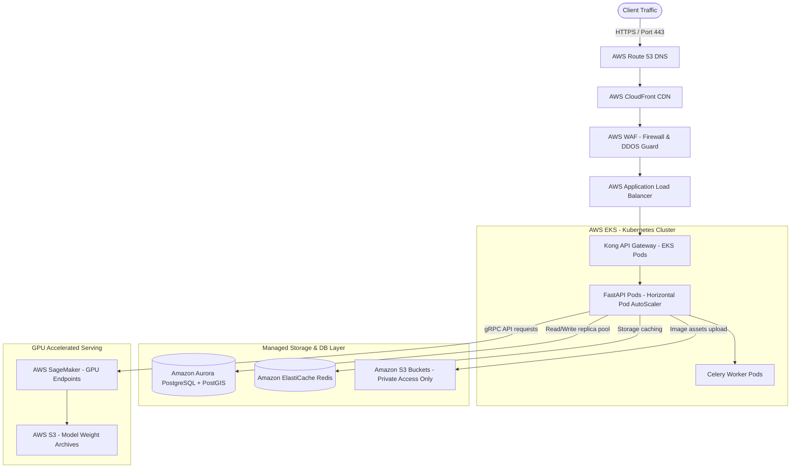

# Production Deployment Checklist & Repository Orchestration Guide
## Project: AgroVision AI — Crop Disease Detection Platform

---

## 1. Production-Ready Deployment Architecture

To transition the local Docker-Compose setup into a resilient production environment, the services are mapped to cloud infrastructure (such as AWS/GCP) using managed Kubernetes clusters and relational safety constraints.



---

## 2. Infrastructure Code Configurations (GitOps Blueprint)

### 2.1 AWS S3 Bucket Access Policy (`aws/s3-policy.json`)
Restricts object uploads and reads to the API application role.

```json
{
  "Version": "2012-10-17",
  "Statement": [
    {
      "Sid": "AllowFastAPIAccessOnly",
      "Effect": "Allow",
      "Principal": {
        "AWS": "arn:aws:iam::123456789012:role/FastAPIRuntimeRole"
      },
      "Action": [
        "s3:GetObject",
        "s3:PutObject",
        "s3:DeleteObject"
      ],
      "Resource": "arn:aws:s3:::agrovision-scans-bucket/*"
    }
  ]
}
```

### 2.2 Kubernetes Deployment Manifest (`k8s/fastapi-deployment.yaml`)
Configures autoscaling properties, resources, and probes for FastAPI instances.

```yaml
apiVersion: apps/v1
kind: Deployment
metadata:
  name: agrovision-backend
  namespace: production
  labels:
    app: agrovision-backend
spec:
  replicas: 3
  selector:
    matchLabels:
      app: agrovision-backend
  template:
    metadata:
      labels:
        app: agrovision-backend
    spec:
      containers:
      - name: fastapi-app
        image: 123456789012.dkr.ecr.us-east-1.amazonaws.com/agrovision-backend:v1.0.0
        ports:
        - containerPort: 8000
        resources:
          limits:
            cpu: "1"
            memory: 1Gi
          requests:
            cpu: 500m
            memory: 512Mi
        envFrom:
        - secretRef:
            name: db-credentials-secret
        livenessProbe:
          httpGet:
            path: /api/v1/healthz
            port: 8000
          initialDelaySeconds: 15
          periodSeconds: 10
        readinessProbe:
          httpGet:
            path: /api/v1/healthz
            port: 8000
          initialDelaySeconds: 10
          periodSeconds: 5
---
apiVersion: autoscaling/v2
kind: HorizontalPodAutoscaler
metadata:
  name: agrovision-backend-hpa
  namespace: production
spec:
  scaleTargetRef:
    apiVersion: apps/v1
    kind: Deployment
    name: agrovision-backend
  minReplicas: 3
  maxReplicas: 10
  metrics:
  - type: Resource
    resource:
      name: cpu
      target:
        type: Utilization
        averageUtilization: 75
```

### 2.3 Prometheus Monitoring Setup (`prometheus/prometheus-scrape.yaml`)
Targets backend endpoint metrics collection.

```yaml
scrape_configs:
  - job_name: 'fastapi-backend-metrics'
    scrape_interval: 10s
    metrics_path: /metrics
    static_configs:
      - targets: ['agrovision-backend.production.svc.cluster.local:8000']

  - job_name: 'torchserve-ml-metrics'
    scrape_interval: 10s
    metrics_path: /metrics
    static_configs:
      - targets: ['torchserve-service.production.svc.cluster.local:8082']
```

---

## 3. Pre-Flight Production Checklist

Before executing deploying updates, review configurations against this checklists framework:

### 3.1 Security Controls & Permissions Audit
*   [ ] **JWT Secrets Configuration:** `JWT_SECRET` must be set via env variables using AES 256 keys (e.g. AWS Secrets Manager), never checked into Git code repositories.
*   [ ] **DB Password encryption:** Access permissions rules on SQL databases restricted strictly to backend service runtime containers.
*   [ ] **HTTPS / SSL Encryption:** Enforce TLS 1.3 protocol restrictions on all incoming domains.
*   [ ] **CORS Restrictions:** Modify `CORSMiddleware` parameters to replace wildcards (`*`) with verified client domain subfolders (e.g. `https://app.agrovision.ai`).

### 3.2 Data & Database Resilience Settings
*   [ ] **PostgreSQL pooling values:** Setup connection pooling limits (`pool_size=20`, `max_overflow=10` in SQLAlchemy) to handle high parallel scans traffic.
*   [ ] **Materialized Views Auto-Refresh:** Validate Celery cron schedules are registered to update outbreak maps daily.
*   [ ] **DB Backup schedules:** Setup automated daily snapshots of RDS volumes with a 30-day retention scheme.

### 3.3 Machine Learning Serving Integrity
*   [ ] **Model weights validation:** Confirm `.mar` weights archives match the validated holdout dataset accuracy limits.
*   [ ] **GPU memory allocations:** Confirm TorchServe instance allocations do not leak CUDA memory buffers under load tests.
*   [ ] **CDN cache limits:** Confirm edge `.tflite` model download binaries are correctly cached at CloudFront edges.

---

## 4. Execution / Deployment Commands Pipeline

To orchestrate the deployment steps from your local machine:

### Step 1: ECR Registry Login
Authenticate your local Docker client against your target AWS ECR container repository:
```bash
aws ecr get-login-password --region us-east-1 | docker login --username AWS --password-stdin 123456789012.dkr.ecr.us-east-1.amazonaws.com
```

### Step 2: Build & Push Container Clusters
```bash
# Backend Build
docker build -t agrovision-backend:v1.0.0 ./agrovision-backend
docker tag agrovision-backend:v1.0.0 123456789012.dkr.ecr.us-east-1.amazonaws.com/agrovision-backend:v1.0.0
docker push 123456789012.dkr.ecr.us-east-1.amazonaws.com/agrovision-backend:v1.0.0

# Frontend Build
docker build -t agrovision-frontend:v1.0.0 ./agrovision-frontend
docker tag agrovision-frontend:v1.0.0 123456789012.dkr.ecr.us-east-1.amazonaws.com/agrovision-frontend:v1.0.0
docker push 123456789012.dkr.ecr.us-east-1.amazonaws.com/agrovision-frontend:v1.0.0
```

### Step 3: Run K8s Manifest Integrations
Apply resource updates directly to EKS configurations:
```bash
kubectl apply -f k8s/fastapi-deployment.yaml
```

---

*This production deployment specification ensures scalable architecture provisioning, secure credentials management, and observable system metric configurations for AgroVision AI.*
